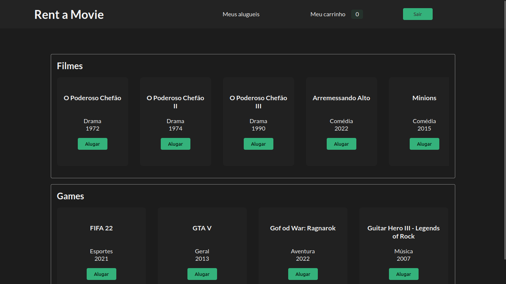
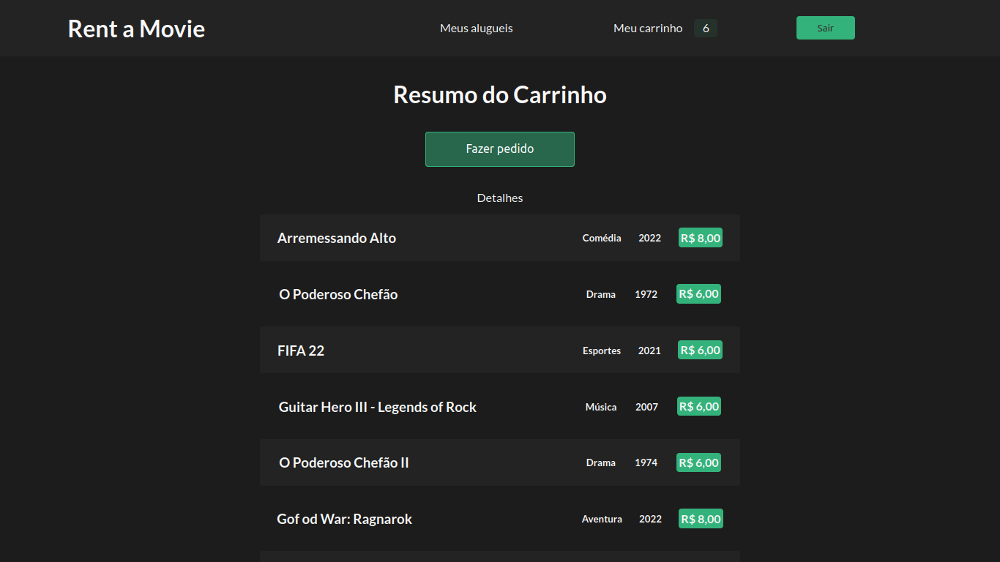

# Rent a Movie [Front-end]

A aplicação consiste em um site para uma locadora de filmes. Projeto feito utilizando Typescript, Node, Express, Prisma, Supabase(Postgresql) e Next.js.





## :rocket: Como rodar o projeto?

### :warning: O projeto está em construção, existem alguns erros de tipagem que impedem o build. 

Para rodar o projeto localmente, você deve clonar este repositório e o repositório [back-end](https://github.com/matkaf/rent-a-movie-api)

O usuário de teste é:

```
  E-mail: teste@teste.com
  
  Senha: teste@123
```  

1. Faça o clone do repositório para sua máquina:
```bash
git clone git@github.com:matkaf/rent-a-movie-front.git
```

2. Entre na pasta do projeto e instale as dependências:
```bash
cd rent-a-movie-front
npm install
```

3. Inicie a aplicação:
```bash
npm run dev

```
## Tecnologias utilizadas:

  Typescript

  Next.js

  Styled-components
